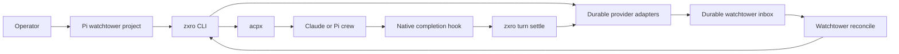

# Product architecture

## Product thesis

zxro keeps durable identities and artifacts for agent-coordinated work. It does not run language models, own coding-agent conversations, or decide what work should happen next. A human or watchtower can address a stable work item while the underlying coding session is created, resumed, replaced, or inspected through another tool.

The first use case is a Pi watchtower coordinating several Pi and Claude crews through ACP/acpx. The same watchtower may coordinate work in several repositories or worktrees at once.

## System boundary

zxro owns:

- watchtower identities and their project directories;
- work identities that survive multiple crew turns;
- turn identities for individual delegated executions;
- durable turn results and lifecycle events;
- per-watchtower event delivery order, read acknowledgement, and independent handled state;
- metadata propagation through `ZXRO_*` environment variables;
- the provider-neutral durable-store behavior exposed through the zxro CLI.

zxro does not own:

- agent process hosting or conversation persistence;
- ACP protocol implementation;
- model selection, tools, permissions, or context management inside a coding harness;
- worktree creation, branch policy, review policy, testing policy, or merge policy;
- task decomposition, prioritization, or routing decisions;
- a mandatory database, mail server, work tracker, or storage engine.

For v0.x, acpx owns the agent-session layer. Pi and Claude own their native execution behavior. The watchtower owns routing decisions.

## Architectural principles

- Durable identity is independent from native session identity. `work_id` must not be derived from a cwd, process ID, or provider session ID.
- Metadata stays outside the model conversation. zxro passes identity through environment variables and persists authoritative durable state through the active store provider.
- The watchtower project and the crew target are separate directories. A watchtower loads its own `AGENTS.md`, skills, prompts, and settings from its project cwd. Each crew turn has an independent target cwd.
- Multiple watchtowers may share one `$ZXRO_HOME`. Use separate homes when operators, companies, customers, or experiments must not share durable zxro state.
- Integrations reduce to CLI operations. Pi extensions, Claude hooks, CI jobs, and humans must be able to produce the same durable state through documented zxro commands.
- Storage engines are replaceable behind the [durable store contract](./contracts/durable-store.md). The built-in indexed-JSON layout is the first provider, not the product contract.
- Durable turn state is committed before a settlement event is published. A lost process between those writes must be repairable by idempotent retry, and a mailbox event must never point at a missing durable result.
- Delivery position and attention are separate. Read ack records what the watchtower has observed; handled state records which actionable events no longer need attention.
- Reconciliation cost is bounded by new or unresolved bounded events, not task age or artifact size.
- Context is progressively disclosed. Watchtowers start from bounded mailbox events, then fetch current work state, turn metadata, or referenced artifacts only when the routing decision needs more evidence.
- Native session recovery is a last resort. zxro records enough session metadata to help an operator find and resume the underlying Pi or Claude conversation without making native session formats part of the zxro contract.

## Durable provider boundary

zxro's public commands target logical capabilities rather than storage-specific files or tables:

```text
zxro CLI
   |
   +-- registry/work adapter
   +-- turn adapter
   +-- artifact adapter
   +-- mailbox adapter
```

One provider may implement every capability. Providers may also be composed. A future setup could use Beads for work records, zxro's local files for turns and artifacts, and a local mail CLI for inbox delivery and attention handling.

Provider composition does not change the public zxro commands, object meanings, settlement ordering, mailbox semantics, or progressive-disclosure behavior. Optional provider dependencies remain optional and must not become prerequisites for the built-in CLI.

No distributed transaction is required across composed providers. zxro uses ordered, idempotent settlement: persist artifacts, commit terminal turn state, publish the matching mailbox event, then report success. A crash between terminal-state commit and publication leaves a recoverable unpublished settlement.

## Major capabilities

| Capability | Responsibility | Owner |
|---|---|---|
| Watchtower registry | Map a stable watchtower ID to its orchestration project cwd and optional runtime session address | zxro durable provider |
| Work registry | Keep a stable logical work ID across coder, reviewer, tester, and follow-up turns | zxro durable provider |
| Turn ledger | Record one delegated execution, target cwd, agent, session address, state, bounded summary, and artifact references | zxro durable provider |
| Artifact store | Keep potentially large per-turn reports, logs, and evidence separate from routine reconciliation records | zxro durable provider |
| Inbox event log | Append immutable ordered, bounded work events with stable event IDs | zxro durable provider |
| Read acknowledgement | Record the highest generation durably observed by a watchtower | zxro durable provider |
| Attention handling | Track handled state independently by event ID so events may be processed out of generation order | zxro durable provider |
| Agent sessions | Create, persist, queue, resume, and cancel coding-agent conversations | acpx / ACP agent |
| Agent lifecycle | Produce native completion signals such as Pi `agent_settled` or Claude `Stop` | coding harness |
| Routing | Decide which crew or operator should act next | watchtower / human |

## End-to-end flow



A typical work item may move through several persistent crew sessions:

```text
work: auth-fix
  coder-auth turn 1
  reviewer-auth turn 1
  coder-auth turn 2
  tester-auth turn 1
  done
```

The `work_id` stays stable. Every delegated execution gets a new `turn_id`. Crew session names may be reused when follow-up work should keep conversation context.

## Mailbox delivery and attention

Every actionable settlement event has two independent coordinates:

```text
event_id    stable identity for attention handling
generation  monotonic delivery order / read position
```

The watchtower also has two independent durable states:

```text
read ack       highest generation durably observed
handled state  event_id -> handled_at
```

This supports bursts of simultaneous crew completions without forcing priority order to equal delivery order.

A typical cycle is:

```text
zxro inbox unread --watchtower main
  -> observe new bounded events
  -> zxro ack --watchtower main --through N
  -> zxro inbox pending --watchtower main
  -> choose highest-priority event
  -> act
  -> zxro inbox handle <event-id>
```

Ack may advance past an unhandled event. That event remains in `pending` until explicitly handled.

`work close`, read ack, and event handling are separate state transitions.

## Progressive context disclosure

A long-running work item must not become more expensive to reconcile just because it has accumulated history. zxro separates routing data from evidence so the watchtower can read only as deep as the current decision requires.

The default read path is:

```text
Level 0a  zxro inbox unread --watchtower <id>
          new bounded delivery since read ack

Level 0b  zxro inbox pending --watchtower <id>
          bounded unresolved attention, including already-read events

Level 1   zxro work show <work-id>
          current state, latest bounded summary, current references

Level 2   zxro turn show <turn-id>
          one turn's metadata, outcome, bounded summary, artifact references

Level 3   zxro artifact path <artifact-ref>
          explicit resolution of the full report, log, diff, or evidence
```

Routine commands must not inline artifact contents. They may return references, byte sizes, media/type hints, and bounded summaries.

A settled turn produces two different things:

1. A small immutable inbox event used for routing and attention.
2. Zero or more referenced artifacts used only when deeper inspection is necessary.

Example inbox event:

```json
{
  "event_id": "evt-7a63...",
  "generation": 17,
  "type": "turn_settled",
  "watchtower_id": "main",
  "work_id": "auth-fix",
  "turn_id": "550e8400-e29b-41d4-a716-446655440000",
  "outcome": "completed",
  "summary": "Reviewer found one blocker in refresh-token expiry handling.",
  "artifact_refs": [
    "artifact:550e8400-e29b-41d4-a716-446655440000:review"
  ]
}
```

The event summary is routing context, not a handoff document. v0.x limits summaries to 1,000 Unicode characters after normalization. Larger material belongs in an artifact.

zxro must not maintain one append-only handoff document whose full contents are expected to be read on every update. Each turn owns its own result and artifacts. Work records point at current or relevant turns without copying their accumulated contents.

This gives zxro two practical context-cost invariants:

```text
unread cost ~= new delivery
pending cost ~= unresolved bounded events
```

Neither cost may scale with accumulated artifact bytes.

## Watchtower and crew cwd

A watchtower has a dedicated project directory, for example:

```text
~/watchtowers/main/
├── AGENTS.md
├── .pi/
│   ├── skills/
│   └── prompts/
└── ...
```

The watchtower session runs from that directory. Its crews may operate anywhere else:

```text
main watchtower
├── ~/src/rozoro-wt/pr-63     Claude coder
├── ~/src/xatu-wt/auth        Pi scout
└── ~/src/another-repo        Claude reviewer
```

`watchtower.cwd` is the orchestration project. `turn.cwd` is the crew target. zxro must never infer one from the other.

## Multiple watchtowers and isolation

A zxro home is one durable-state and trust boundary. It may contain several watchtowers when sharing state is intentional:

```text
$ZXRO_HOME
├── watchtower: alice
├── watchtower: bob
└── watchtower: release
```

Separate companies, customers, operators, or experiments that must not share zxro state should use separate homes:

```text
~/.zxro/acme/
~/.zxro/contoso/
~/.zxro/personal/
```

Providers may implement that separation with directories, databases, profiles, or namespaces. The adapter binds all operations to the active zxro home and must not silently search unrelated provider namespaces.

zxro does not model companies or organizations as domain objects in v0.x.

## Integration posture

| External system | Purpose | Direction | Failure posture |
|---|---|---|---|
| acpx | Persistent ACP sessions and agent transport | zxro/operator -> acpx | zxro records no runtime claim it cannot verify; native recovery remains available |
| Pi | Watchtower and crew agent | bidirectional through acpx; later native extension -> zxro | `agent_settled` integration is optional until the CLI contract is proven |
| Claude Code | Crew agent | bidirectional through acpx; later hook -> zxro | `Stop`/failure integration is optional until the CLI contract is proven |
| Built-in file provider | Dependency-free v0 durable store | zxro read/write | fail closed on malformed, unsafe, or conflicting state |
| Optional work/mail providers | Replace one or more durable capabilities behind adapters | zxro adapter <-> provider | provider failure must preserve zxro ordering/idempotency/attention semantics or fail the operation |

## Data and trust boundaries

`$ZXRO_HOME`, defaulting to `~/.zxro`, selects the active zxro durable-state namespace. The built-in provider stores state there directly. External adapters may use another storage engine, but must bind it to the same logical home and keep unrelated homes isolated.

Native agent stores remain authoritative for their own conversation transcripts.

One zxro home may contain several cooperating watchtowers. Separate homes are the v0.x isolation mechanism when durable state must not cross an operator, company, customer, or experimental boundary.

zxro must not store provider credentials. Child processes may inherit provider-specific environment variables, but zxro only persists non-secret metadata and session references needed for its contract.

## Non-goals

- A new agent framework or ACP implementation.
- A mandatory daemon, scheduler, web service, database, work tracker, or mail server in v0.x.
- Replacing acpx session persistence.
- Replacing Pi or Claude native session formats.
- Making a watchtower continuously resident. A watchtower may be a persistent conversation that wakes for discrete turns.
- Automatically loading complete work history into an agent context.
- Treating zxro artifacts as prompts. Artifacts are evidence that consumers fetch deliberately.
- Exposing provider-native schemas as zxro's public storage contract.

## Related

- [Ubiquitous language](./ubiquitous-language.md)
- [Durable store contract](./contracts/durable-store.md)
- [Decision 0002: Separate inbox delivery position from attention handling](../decisions/0002-separate-delivery-from-attention.md)
- [v0.x goal and scope](../v0.x/scope/goal-and-scope.md)
- [v0.x CLI](../v0.x/surfaces/cli.md)
- [Native session recovery](../playbooks/native-session-recovery.md)
