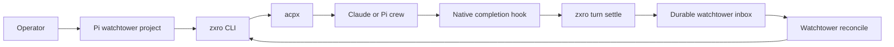

# Product architecture

## Product thesis

zxro keeps durable identities and artifacts for agent-coordinated work. It does not run language models, own coding-agent conversations, or decide what work should happen next. A human or watchtower can address a stable work item while the underlying coding session is created, resumed, replaced, or inspected through another tool.

The first use case is a Pi watchtower coordinating several Pi and Claude crews through ACP/acpx. The same watchtower may coordinate work in several repositories or worktrees at once.

## System boundary

zxro owns:

- watchtower identities and their project directories;
- work identities that survive multiple crew turns;
- turn identities for individual delegated executions;
- durable turn results and lifecycle events;
- per-watchtower inbox generations and acknowledgements;
- metadata propagation through `ZXRO_*` environment variables.

zxro does not own:

- agent process hosting or conversation persistence;
- ACP protocol implementation;
- model selection, tools, permissions, or context management inside a coding harness;
- worktree creation, branch policy, review policy, testing policy, or merge policy;
- task decomposition, prioritization, or routing decisions.

For v0.x, acpx owns the agent-session layer. Pi and Claude own their native execution behavior. The watchtower owns routing decisions.

## Architectural principles

- Durable identity is independent from native session identity. `work_id` must not be derived from a cwd, process ID, or provider session ID.
- Metadata stays outside the model conversation. zxro passes identity through environment variables and persists the authoritative record on disk.
- The watchtower project and the crew target are separate directories. A watchtower loads its own `AGENTS.md`, skills, prompts, and settings from its project cwd. Each crew turn has an independent target cwd.
- Integrations reduce to CLI operations. Pi extensions, Claude hooks, CI jobs, and humans must be able to produce the same durable state through documented zxro commands.
- Durable state is written before a best-effort wake or notification. A lost wake must not lose the work result.
- Native session recovery is a last resort. zxro records enough session metadata to help an operator find and resume the underlying Pi or Claude conversation without making native session formats part of the zxro contract.

## Major capabilities

| Capability | Responsibility | Owner |
|---|---|---|
| Watchtower registry | Map a stable watchtower ID to its orchestration project cwd and optional runtime session address | zxro |
| Work registry | Keep a stable logical work ID across coder, reviewer, tester, and follow-up turns | zxro |
| Turn ledger | Record one delegated execution, target cwd, agent, session address, state, and result | zxro |
| Inbox | Append ordered work events for a watchtower and expose pending generations | zxro |
| Acknowledgement | Record the highest inbox generation the watchtower has consumed | zxro |
| Agent sessions | Create, persist, queue, resume, and cancel coding-agent conversations | acpx / ACP agent |
| Agent lifecycle | Produce native completion signals such as Pi `agent_settled` or Claude `Stop` | coding harness |
| Routing | Decide which crew or operator should act next | watchtower / human |

## End-to-end flow



A typical work item may move through several persistent crew sessions:

```text
work: auth-fix
  coder-auth turn 1
  reviewer-auth turn 1
  coder-auth turn 2
  tester-auth turn 1
  done
```

The `work_id` stays stable. Every delegated execution gets a new `turn_id`. Crew session names may be reused when follow-up work should keep conversation context.

## Watchtower and crew cwd

A watchtower has a dedicated project directory, for example:

```text
~/watchtowers/main/
├── AGENTS.md
├── .pi/
│   ├── skills/
│   └── prompts/
└── ...
```

The watchtower session runs from that directory. Its crews may operate anywhere else:

```text
main watchtower
├── ~/src/rozoro-wt/pr-63     Claude coder
├── ~/src/xatu-wt/auth        Pi scout
└── ~/src/another-repo        Claude reviewer
```

`watchtower.cwd` is the orchestration project. `turn.cwd` is the crew target. zxro must never infer one from the other.

## Integration posture

| External system | Purpose | Direction | Failure posture |
|---|---|---|---|
| acpx | Persistent ACP sessions and agent transport | zxro/operator -> acpx | zxro records no runtime claim it cannot verify; native recovery remains available |
| Pi | Watchtower and crew agent | bidirectional through acpx; later native extension -> zxro | `agent_settled` integration is optional until the CLI contract is proven |
| Claude Code | Crew agent | bidirectional through acpx; later hook -> zxro | `Stop`/failure integration is optional until the CLI contract is proven |
| Unix filesystem | Durable zxro records | zxro read/write | fail closed on malformed, unsafe, or conflicting state |

## Data and trust boundaries

`$ZXRO_HOME`, defaulting to `~/.zxro`, is authoritative for zxro identity and mailbox state. Native agent stores remain authoritative for their own conversation transcripts.

zxro must not store provider credentials. Child processes may inherit provider-specific environment variables, but zxro only persists the names of metadata variables it owns and non-secret session references needed for recovery.

## Non-goals

- A new agent framework or ACP implementation.
- A daemon, scheduler, web service, or database in v0.x.
- Replacing acpx session persistence.
- Replacing Pi or Claude native session formats.
- Making a watchtower continuously resident. A watchtower may be a persistent conversation that wakes for discrete turns.

## Related

- [Ubiquitous language](./ubiquitous-language.md)
- [v0.x goal and scope](../v0.x/scope/goal-and-scope.md)
- [v0.x CLI](../v0.x/surfaces/cli.md)
- [Native session recovery](../playbooks/native-session-recovery.md)
