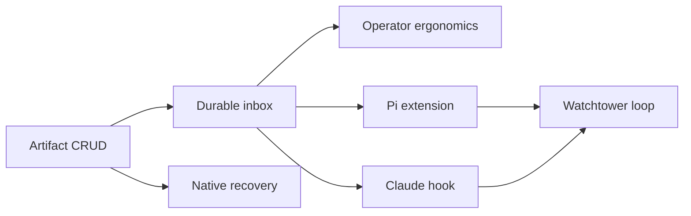

# v0.x implementation plan

## Delivery strategy

Build the CLI as the first product. Every state transition must be runnable by hand and testable through subprocess calls before any harness hook performs it automatically. Keep increments small enough that the on-disk artifacts can be inspected with `cat`, `find`, and `python3 -m json.tool` after each step.

The first complete slice is the durable artifact loop:

```text
watchtower create
  -> work create
  -> turn create
  -> manually run a worker
  -> turn settle
  -> inbox pending
  -> ack
  -> inspect
```

Do not add Pi or Claude integration until this loop is stable.

## Milestones

| Milestone | Outcome | Dependencies | Verification | Owner |
|---|---|---|---|---|
| M0: artifact CRUD | Watchtower, work, and turn records can be created, shown, and listed | Python 3.11+ | Black-box CLI tests plus manual inspection of a temporary `$ZXRO_HOME` | zxro |
| M1: durable inbox | Settling a turn appends one ordered watchtower event and `ack` advances consumption | M0 | Duplicate-settle, ordering, ack-boundary, and malformed-state tests | zxro |
| M2: operator ergonomics | `inspect` and optional metadata helpers make manual diagnosis practical | M1 | Manual shell walkthrough without reading zxro source | zxro |
| M3: recovery | Operators can recover Pi or Claude native sessions from zxro/acpx metadata or official native pickers | M0 | Follow the recovery playbook on disposable sessions | zxro docs |
| M4: Pi integration | Pi `agent_settled` produces the same durable settlement as the manual CLI | M1 | Real acpx/Pi smoke test; no private zxro imports | Pi extension |
| M5: Claude integration | Claude `Stop` and failure hooks produce the same durable settlement as the manual CLI | M1 | Real acpx/Claude smoke test; no private zxro imports | Claude hook |
| M6: watchtower loop | Durable inbox settlement can wake a watchtower, which reconciles, acks, and dispatches the next crew turn | M4 or M5 | `coder -> reviewer -> coder -> tester -> done` without operator routing | integration |

## Sequencing



## Initial command build order

1. `zxro watchtower create|show|list`
2. `zxro work create|show|list`
3. `zxro turn create|show|list`
4. `zxro turn settle`
5. `zxro inbox pending`
6. `zxro ack`
7. `zxro inspect`
8. Optional generic metadata helpers such as `zxro turn env` or `zxro turn run` only after the core loop is usable.

The command contract is specified in [v0.x CLI](../surfaces/cli.md).

## Parallel work

Documentation, CLI implementation, and black-box tests may proceed together once the artifact shapes and invariants are fixed. Pi and Claude integration work may proceed in parallel after M1 because both integrations terminate at the same `zxro turn settle` contract.

The Pi and Claude integrations must not invent provider-specific durable schemas. Provider details belong in source payloads or optional session-reference fields.

## Risks

| Risk | Impact | Mitigation | Trigger |
|---|---|---|---|
| Artifact schema changes too early | Migration noise before product semantics are known | Keep schemas small and version records; avoid speculative fields | Repeated manual edits to the same fields |
| Concurrent hook writers corrupt inbox | Lost or malformed work events | Lock appends and test concurrent settlements before integration | Any JSONL parse failure or duplicate generation |
| Native completion semantics differ | False completion or missed work | Normalize Pi and Claude only at the CLI boundary; keep ACP completion as a validation signal | Hook fires while meaningful work is still pending |
| acpx/native IDs diverge | Operator cannot recover a session | Store identity types separately and document native recovery | A session cannot be resumed from zxro metadata |
| Watchtower and crew cwd are conflated | Wrong skills/config or edits in wrong project | Store both explicitly and never infer one from the other | Any command defaults a crew cwd from watchtower cwd |

## Completion evidence

- [ ] Core CLI tests pass with `python3 -m unittest discover -s tests -v`.
- [ ] Concurrency tests prove ordered generations and valid JSONL.
- [ ] Manual artifact-loop walkthrough succeeds in a temporary home.
- [ ] Native session recovery works for disposable Pi and Claude sessions.
- [ ] Pi and Claude integrations, when added, call documented CLI commands only.
- [ ] One watchtower coordinates crews in at least two different target cwd values.
- [ ] The automated watchtower loop completes a multi-stage work item without losing durable state.

## Related

- [Execution index](./README.md)
- [v0.x CLI](../surfaces/cli.md)
- [Testing and agent workflow](../engineering/testing-and-agent-workflow.md)
- [Native session recovery](../../playbooks/native-session-recovery.md)
