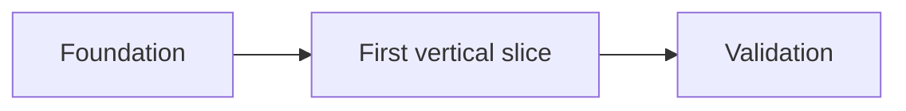

# v0.x Implementation Plan

## Delivery strategy

TODO: Describe increment size, integration strategy, and how work reaches the main branch.

## Milestones

| Milestone | Outcome | Dependencies | Verification | Owner |
|---|---|---|---|---|
| TODO | TODO | TODO | TODO | TODO |

## Sequencing

## Parallel work

TODO: Identify lanes that can proceed independently and their integration contracts.

## Risks

| Risk | Impact | Mitigation | Trigger |
|---|---|---|---|
| TODO | TODO | TODO | TODO |

## Completion evidence

- [ ] Acceptance criteria pass.
- [ ] Required checks pass.
- [ ] Documentation and decision records are current.

## Related

- [Execution index](./README.md)
- [Task cards](./task-cards/README.md)
- [Human decision gates](./human-decision-gates.md)
