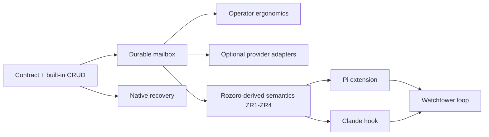

# v0.x implementation plan

## Delivery strategy

Build the CLI as the first product. Every state transition must be runnable by hand and testable through subprocess calls before any harness hook performs it automatically.

Implementation targets the [durable store contract](../../architecture/contracts/durable-store.md), not the first on-disk schema. The first provider is the dependency-free local indexed-JSON implementation. Optional providers such as Beads or a local mailbox CLI can be added later as adapters if they pass the same semantic conformance tests.

The first complete slice is the durable artifact loop:

```text
watchtower create
  -> work create
  -> turn create
  -> manually run a worker
  -> turn settle
  -> inbox unread
  -> ack observed delivery
  -> inbox pending
  -> handle one event
  -> work show
  -> turn list --work <work-id>
  -> turn show <turn-id>
  -> artifact path <artifact-ref> when deeper evidence is needed
```

Every command in this first-slice loop is available on `master`. The joined `inspect` command is future M2 scope and is unavailable on `master`.

Do not add Pi or Claude integration until this loop is stable.

## Provider boundary

zxro implementation code should separate command behavior from provider mechanics from the beginning.

Conceptually:

```text
zxro CLI
   |
   +-- registry/work adapter
   +-- turn adapter
   +-- artifact adapter
   +-- mailbox adapter
```

The built-in provider may implement all four with local files. A later composition may use Beads for work, local files for turns/artifacts, and a mail CLI for delivery/read/handled state. Public commands and lifecycle semantics stay unchanged.

Avoid premature plugin infrastructure. A small internal Python protocol or adapter boundary is enough for v0. Do not add dynamic package loading, entry points, or third-party dependency injection.

## Milestones

| Milestone | Outcome | Dependencies | Verification | Owner |
|---|---|---|---|---|
| M0: contract + built-in CRUD | Watchtower, work, and turn behavior implements the provider-neutral contract through the local file adapter | Python 3.11+ | Black-box CLI tests plus durable-store conformance cases | zxro |
| M1: durable mailbox | Settling a turn commits its durable result before one idempotent ordered event; unread/ack track delivery while pending/handle track attention independently | M0 | Duplicate-settle, crash-gap, ordering, read-ack, out-of-order-handle, and malformed-state tests | zxro |
| MR: Rozoro-derived semantics | ZR1 structured routing verdict, ZR2 durable brief reference, ZR3 late session binding, and ZR4 multiple per-turn artifacts complete the durable work layer per the [ZR1-ZR4 delivery plan](./rozoro-requirements-plan.md) | M1 | Rozoro-shaped scenario tests from the [requirements report](../../reports/2026-08-25-rozoro-derived-requirements.md) | zxro |
| M2: operator ergonomics | `inspect` and metadata helpers make manual diagnosis practical without loading artifact bodies | M1 | Manual shell walkthrough without reading zxro source | zxro |
| M3: recovery | Operators can recover Pi or Claude native sessions from zxro/acpx metadata or official native pickers | M0 | Follow the recovery playbook on disposable sessions | zxro docs |
| M4: optional store adapters | Candidate work/mail providers can replace one capability without changing zxro CLI behavior | M1 | Run the same conformance suite against each adapter; document operational dependencies | adapter |
| M5: Pi integration | Pi `agent_settled` produces the same durable settlement as the manual CLI | M1 | Real acpx/Pi smoke test; no private zxro imports | Pi extension |
| M6: Claude integration | Claude `Stop` and failure hooks produce the same durable settlement as the manual CLI | M1 | Real acpx/Claude smoke test; no private zxro imports | Claude hook |
| M7: watchtower loop | Durable settlement can wake a watchtower, which observes new delivery, prioritizes unresolved attention, handles events, and dispatches the next crew turn | M5 or M6 | `coder -> reviewer -> coder -> tester -> done` without operator routing | integration |

## Sequencing



MR sits between the durable mailbox and the harness integrations so Pi and Claude hooks settle turns with structured verdicts from their first version instead of retrofitting them. Work-package designs, dependencies, and acceptance criteria live in the [ZR1-ZR4 delivery plan](./rozoro-requirements-plan.md).

Provider evaluation may happen in parallel with implementation. It must not block the built-in provider. If a candidate fits later, write an adapter and run the conformance suite instead of changing the public CLI.

## Initial command build order

The M0 and M1 commands in this order are available on `master`:

1. `zxro watchtower create|show|list`
2. `zxro work create|show|list|close`
3. `zxro turn create|show|list`
4. `zxro turn settle`
5. `zxro inbox unread`
6. `zxro ack`
7. `zxro inbox pending`
8. `zxro inbox handle`
9. `zxro artifact path`

`zxro inspect`, `zxro turn env`, and `zxro turn run` remain future M2 commands. They are unavailable on `master` and are not part of the hand-runnable M0/M1 loop.

The command contract and future examples are specified in [v0.x CLI](../surfaces/cli.md).

## Settlement implementation order

The CLI-level settlement operation must preserve this sequence even when capabilities come from different providers:

```text
persist artifacts
  -> commit terminal turn state with its allocated event ID
  -> publish one unhandled mailbox event with that event ID
  -> report success
```

A crash after terminal-state commit but before mailbox publication is recoverable. Retry must publish the missing event without changing the terminal result or allocating a duplicate event. A mailbox event may never point to a missing durable turn result.

This design avoids requiring distributed transactions across optional providers.

## Delivery and attention implementation

Mailbox state has three independent durable pieces:

```text
immutable event log
read ack: highest generation observed
handled state: event_id -> handled_at
```

`ack` may advance past unhandled events. Those events stay in `inbox pending`. `inbox handle` may process them in any order and is idempotent.

Do not encode handled state by rewriting the immutable event or by moving the read cursor. Do not make `work close` imply handle or ack.

## Parallel work

Documentation, CLI implementation, black-box tests, and off-the-shelf provider evaluation may proceed together once contract semantics are fixed.

Pi and Claude integration work may proceed in parallel after MR because both integrations terminate at the same `zxro turn settle` CLI contract, and that contract gains its structured verdict fields in MR.

Provider adapters and harness integrations must not invent provider-specific durable schemas in the public CLI. Provider details stay behind adapters or in explicitly typed optional metadata.

## Risks

| Risk | Impact | Mitigation | Trigger |
|---|---|---|---|
| Built-in file layout becomes accidental public API | Provider swaps become migrations of every caller | Test commands and durable semantics, not private paths; keep provider contract authoritative | Agent instructions start depending on internal paths |
| Read position is confused with completed attention | Lower-priority events disappear when a later generation is acknowledged | Keep read ack and per-event handled state separate | Ack past an unhandled event removes it from pending |
| Split providers create a crash gap | Settled work never reaches the watchtower or an event points to missing state | Commit result and event ID first, publish that identity second, repair missing publication on retry | Process dies during settlement |
| Candidate provider requires hidden runtime machinery | Lightweight zxro becomes operationally heavy | Keep adapters optional and record daemon/server/dependency requirements during evaluation | Candidate passes semantics but adds mandatory infrastructure |
| Concurrent hook writers corrupt or lose work | Missed routing events | Conformance tests assume 10 to 12 near-simultaneous completions; adapter serialization is acceptable | Duplicate generation, lost write, or malformed state |
| Native completion semantics differ | False completion or missed work | Normalize Pi and Claude only at the CLI boundary; keep ACP completion as a validation signal | Hook fires while meaningful work is still pending |
| acpx/native IDs diverge | Operator cannot recover a session | Store identity types separately and document native recovery | A session cannot be resumed from zxro metadata |
| Watchtower and crew cwd are conflated | Wrong skills/config or edits in wrong project | Store both explicitly and never infer one from the other | Any command defaults a crew cwd from watchtower cwd |

## Completion evidence

M0 merged in PR [#6](https://github.com/odjhey/zxro/pull/6) as [`7dbb53336ff111106d986b38d084f3314b86a0f2`](https://github.com/odjhey/zxro/commit/7dbb53336ff111106d986b38d084f3314b86a0f2). M1 merged in PR [#7](https://github.com/odjhey/zxro/pull/7) as [`7a3db5acd7785bcd3946604ef2282ea887b4f7ce`](https://github.com/odjhey/zxro/commit/7a3db5acd7785bcd3946604ef2282ea887b4f7ce). PR [#17](https://github.com/odjhey/zxro/pull/17) then added and independently accepted the public-CLI multi-turn proof at exact head [`c0a8c49f49836ef3b182883a522c50b917d007a1`](https://github.com/odjhey/zxro/commit/c0a8c49f49836ef3b182883a522c50b917d007a1). The proof merged as [`a191ae7d00ed2d1974ab27581bda80b6346c8cde`](https://github.com/odjhey/zxro/commit/a191ae7d00ed2d1974ab27581bda80b6346c8cde); its [post-merge CI run](https://github.com/odjhey/zxro/actions/runs/32795552021) passed all four jobs.

- [x] Core CLI tests pass with `python3 -m unittest discover -s tests -v`.
- [x] Built-in provider passes the durable-store conformance suite.
- [x] Concurrency tests prove ordered generations, stable event IDs, and no lost successful writes.
- [x] Read ack can advance past an unhandled event while `inbox pending` still returns it.
- [x] Events can be handled out of generation order and repeated handle is idempotent.
- [x] Crash-gap test proves a terminal turn can be reconciled into one mailbox event after interruption between commit and publish.
- [x] Manual artifact-loop walkthrough succeeds in a temporary home.
- [ ] Native session recovery works for disposable Pi and Claude sessions.
- [ ] Optional adapters, when added, pass the same required semantics without changing public commands.
- [ ] Pi and Claude integrations, when added, call documented CLI commands only.
- [ ] One watchtower coordinates crews in at least two different target cwd values.
- [ ] The automated watchtower loop completes a multi-stage work item without losing durable state or unresolved attention.

## Related

- [Execution index](./README.md)
- [ZR1-ZR4 delivery plan](./rozoro-requirements-plan.md)
- [Durable store contract](../../architecture/contracts/durable-store.md)
- [Decision 0002](../../decisions/0002-separate-delivery-from-attention.md)
- [v0.x CLI](../surfaces/cli.md)
- [Testing and agent workflow](../engineering/testing-and-agent-workflow.md)
- [Technology stack](../scope/technology-stack.md)
- [Native session recovery](../../playbooks/native-session-recovery.md)
